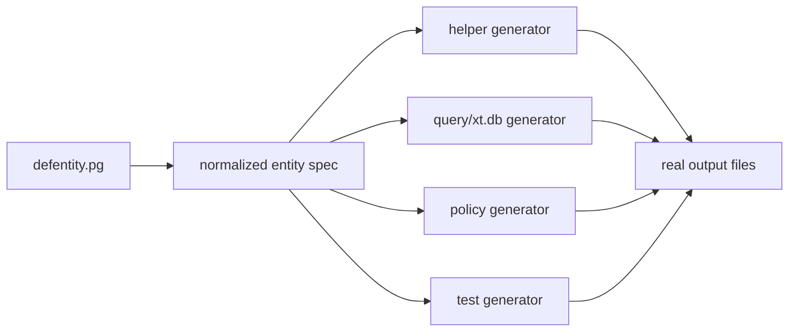

# defentity.pg Generation Model

## Purpose

Define a thin authoring model for `defentity.pg` that stays close to PG
semantics while enabling output-file based generation.

This model should work with the existing backbone:

- `rt.postgres`
- `xt.db`
- `l/script :xtalk` `.clj` modules


## Design Constraints

- stay close to `deftype.pg`
- avoid a macro-heavy system like old `statstrade-core`
- use namespace-level organization where possible
- emit real code files through generation tasks
- support helper function generation like `statstrade-v1` and `gw-v2`


## Recommended Split

### 1. Thin Authoring Macro

`defentity.pg` should:

- look very close to `deftype.pg`
- capture the entity declaration
- register a normalized spec
- avoid hidden large expansions

### 2. Normalized Entity Spec

The true generation spec should be plain data, not macro expansion.

The normalized entity spec should include:

- entity id
- namespace/module
- application
- DB schema
- fields
- refs
- enums
- helper generation hints
- query generation hints

### 3. Explicit Generators

Generators should consume entity specs and emit normal source files for:

- helper DB functions
- query/view specs
- policy files
- tests


## Conceptual Flow




## Proposed Authoring Shape

This is intentionally close to current PG code:

```clojure
(defentity.pg Space
  {:helpers [:crud :archive :membership]
   :queries [:get :list :dashboard]}
  [:organisation {:type :ref :required true :ref {:ns tuo/Organisation}}
   :owner        {:type :ref :required true :ref {:ns tub/User}}
   :visibility   {:type :enum :required true :enum {:ns -/EnumSpaceVisibility}}
   :status       {:type :enum :required true :enum {:ns -/EnumSpaceStatus}}])
```

Notes:

- the base field vector remains PG-first
- most organization should still come from the namespace
- `:helpers` and `:queries` are generation hints, not execution semantics


## Normalized Spec Shape

Conceptual example:

```clojure
{:entity/id 'Space
 :entity/ns  'gwdb.platform.spaces.type-space-base
 :application "gw"
 :db/schema   "gw_type"
 :fields [...]
 :helpers [:crud :archive :membership]
 :queries [:get :list :dashboard]}
```

This data should be what downstream generators consume.


## Generated Helper Output

The first generation target should be helper functions as normal `defn.pg`
source code.

For a `Space` entity, likely outputs are:

- `create-space`
- `update-space`
- `purge-space`
- `get-space`
- `list-spaces`
- `add-space-member`
- `remove-space-member`

These should be written to output files, not hidden in macroexpansion.


## Scope Boundaries

### Server-side only

These belong in `defentity.pg` generation:

- PG table shape
- helper DB functions
- policy generation hooks
- server query helper generation

### Not in the initial entity macro

These should not be forced into `defentity.pg` yet:

- page language
- client hook behavior
- edge cache semantics
- full sync runtime contracts

### Explicit Backbone Constraint

`defentity.pg` generation should not bypass `xt.db`.

Later generation stages should be able to emit or support:

- PG helper code
- `xt.db`-compatible schema/query support
- `l/script :xtalk` `.clj` operational modules that compose those pieces


## Near-Term Implementation Steps

1. Define a normalized entity spec registry in `foundation-base`.
2. Add a thin `defentity.pg` authoring macro that records that spec.
3. Build one generator that emits helper DB functions to a normal source file.
4. Prove the model on the first `Space` slice.
