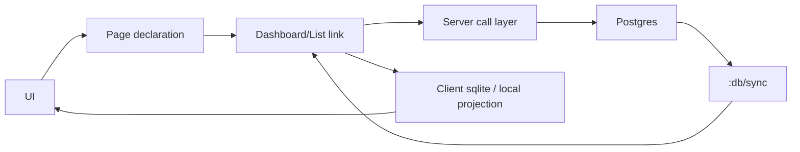

# PG Sync Architecture Plan

## Purpose

This document captures the current architectural direction for a PG-first,
event-driven system spanning:

- `foundation-base`
- `statstrade-core`
- `statstrade-v1`
- `gw-v2`

The goal is to preserve the original strengths of the old system:

- Postgres as the source of truth
- declarative query graphs
- mutations only through named server functions
- automatic client updates through server-originated sync events
- page functionality testable before a UI is fully built

while also preserving newer work in:

- `rt.postgres`
- policies / RLS
- code generation
- inference and generated API artifacts


## Core Decisions

### 1. Source Of Truth

- Postgres is always the source of truth.
- Client sqlite and edge caches are projections.
- Clients may lag.
- Clients must converge from server-originated sync.

### 2. Event Direction

- Events are only `server -> client`.
- The canonical client sync event is `:db/sync`.
- Clients do not emit sync events back to the server.

### 3. Mutation Discipline

- Mutations happen only through named server functions.
- Some mutations may go through a web layer first.
- Even web-mediated mutations must terminate in canonical DB state changes.
- Client truth is never derived from local mutation success alone.
- Client convergence is driven by later `:db/sync`.

### 4. Policy Location

- Policy is server-side only.
- RLS and `defpolicy.pg` stay in the server/database layer.
- Client/page declarations do not encode policy rules.

### 5. Page Scope

- The page layer should stay declarative.
- Common page shapes are:
  - dashboards
  - lists
  - filtered queries
- Page declarations should not encode transport internals.

### 6. Code Generation Style

- Avoid rebuilding the old macro-heavy `statstrade-core` style.
- Prefer step-by-step generation of actual output code files.
- Macros should stay thin.
- Generated artifacts should be diffable and reviewable.


## Repo Roles

### foundation-base

Canonical substrate for:

- `rt.postgres`
- `xt.db`
- DB driver contracts
- SQL generation
- sync architecture primitives

### statstrade-core

Canonical reference for:

- end-to-end graph/view/event architecture
- Postgres -> sqlite -> page flow
- `:db/sync`-oriented client updates

### statstrade-v1

Reference for:

- generated helper function patterns
- policy generation patterns
- older but fuller application structure

### gw-v2

Reference for:

- current `rt.postgres` usage
- policy / RLS workflows
- newer generation and inference tooling


## Architecture Model



### Meaning

- UI renders current page state.
- Page declaration describes what data/actions the page uses.
- Link object coordinates queries, actions, and sync.
- Server calls perform mutations or fetches.
- Postgres commits canonical state.
- Postgres emits `:db/sync`.
- Link consumes `:db/sync` and refreshes local projection/state.


## Authoring Direction

### Server Language

Keep the initial entity language mostly PG-compatible.

Primary authoring forms should remain close to:

- `deftype.pg`
- `defn.pg`
- `defpolicy.pg`

The database layer remains the hard truth.

### defentity.pg

Introduce a thin authoring macro such as `defentity.pg` that:

- remains close to `deftype.pg`
- can inherit organization from the namespace
- registers a normalized entity spec
- drives generation of helper functions

`defentity.pg` should not hide large expansions in macro output.
Instead, it should support code generation of real files.

### Generated Output

From entity specs, generators should emit normal source files for:

- helper DB functions
- policy files
- query/view contracts
- page data contracts
- tests


## Minimal Page Data Model

Do not finalize a large page language yet.

The current stable requirement is only that a page declaration be able to
describe:

- queries it needs
- actions it can call
- `:db/sync` tables/topics it listens to
- filters/params

Example conceptual form:

```clojure
(deflink.js Dashboard
  {:queries {:summary summary-query
             :members members-query}
   :actions {:invite-member invite-member!
             :remove-member remove-member!}
   :listen  ["Organisation" "OrganisationAccessRole" "User"]})
```

This should compile to a plain object spec.


## Link Runtime Model

The runtime should stay simple initially.

### Compiled Link Spec

A compiled link spec should know:

- named queries
- named actions
- listened `:db/sync` tables/topics
- params and filters

### Live Link Instance

A live link instance should expose a small interface:

```clojure
{:data   {:summary ...
          :members ...}
 :status :ready      ;; or :loading | :acting | :error
 :error  nil
 :load! fn
 :set! fn
 :act! fn}
```

### Runtime Behavior

- `load!` runs the link's queries
- `set!` changes params/filters and reruns queries
- `act!` calls a named server mutation and marks the link `:acting`
- incoming `:db/sync` triggers reload or refresh
- successful refresh returns state to `:ready`
- failures set `:error`


## Testing Principle

Testing must begin with the data/sync contract, not the visual page.

### Test Order

1. server command tests
2. server event / `:db/sync` tests
3. client projection or link tests
4. page data contract tests
5. thin UI tests

### Why

If the page is a consumer of synced state, then UI success depends on:

- command correctness
- canonical DB state changes
- `:db/sync` delivery
- link refresh behavior

Therefore the page contract must be testable independently of component layout.


## Dashboard Test Model

The first concrete test target should be a `Dashboard` link, not a full page UI.

### Dashboard Runtime Contract

Given:

- a dashboard link spec
- initial params/filters
- server query handlers
- action handlers
- incoming `:db/sync`

The test should verify:

1. initial load fetches the dashboard blocks
2. state becomes `:ready`
3. calling an action changes state to `:acting`
4. later `:db/sync` causes refresh
5. refreshed data appears in the link state
6. state returns to `:ready`

### Example Pseudo-Test

```clojure
(fact "dashboard link converges from mutation + :db/sync"
  (let [link (dashboard-runtime/create
              Dashboard
              {:organisation-id "org-1"})]

    (.load! link)
    (:status (dashboard-runtime/state link))
    => :ready

    (.act! link :invite-member
           {:email "new@example.com"
            :role "member"})
    (:status (dashboard-runtime/state link))
    => :acting

    (dashboard-runtime/apply-sync!
     link
     {:topic ":db/sync"
      :tables ["OrganisationAccessRole" "User"]})

    (:status (dashboard-runtime/state link))
    => :ready))
```

This is the first test shape to stabilize.


## What We Do Not Need To Decide Yet

The following should remain open for now:

- final page DSL syntax
- rich hook API shape
- exact UI framework bindings
- advanced client state machine semantics
- full edge caching behavior

Those can wait until:

- the DB/sync contract is stable
- one real vertical slice works end-to-end
- the dashboard link test model is proven


## Immediate Next Steps

1. Stabilize the `rt.postgres` / `xt.db` / `:db/sync` contract in `foundation-base`.
2. Recover one vertical slice in `statstrade-core`.
3. Define a thin `defentity.pg` authoring model.
4. Implement generation of helper DB functions as normal output files.
5. Define a minimal `Dashboard` link spec.
6. Build the first dashboard link runtime test before full UI work.


## Summary

The current direction is:

- PG-first
- event-driven
- server-authored truth
- `:db/sync` as the only client sync event
- simple declarative page data contracts
- code generation through real output files
- testing centered on data convergence before UI rendering
