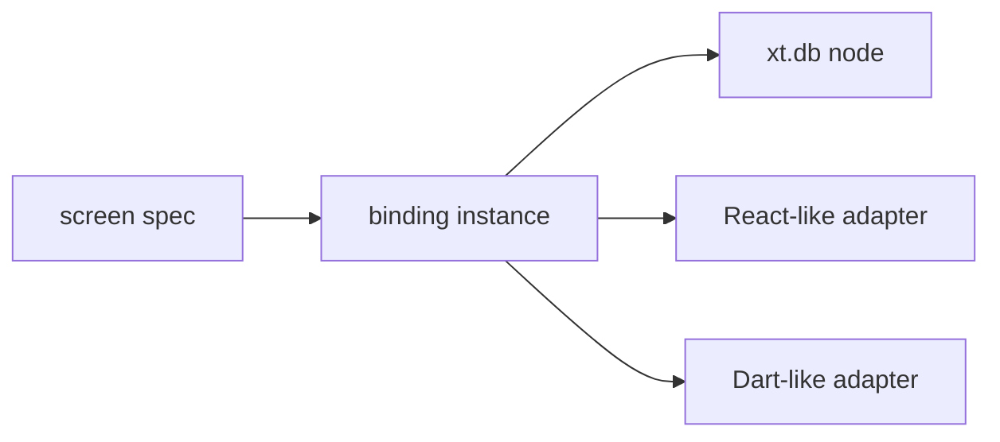

# Hypothetical `xt.db` UI Binding Framework

This document sketches a hypothetical declarative UI framework built on top of
`xt.db`.

The goal is to make `xt.db` easy to attach to:

- React-like frameworks
- Dart / Flutter-like frameworks
- any UI runtime that can subscribe to state and call commands

This is a **design README**, not an implemented library.


## Purpose

The framework sits between:

- **declarative `xt.db` specs**
- **live `xt.db` node/model/view state**
- **framework-specific rendering code**

It should let application code describe:

- what views a screen needs
- what inputs those views use
- what actions the screen can trigger

without making UI components call low-level `xt.db.node.instance-model` APIs
directly.


## The Core Idea

The framework has three layers:

1. **screen spec** — plain declarative data
2. **binding instance** — live state + commands
3. **framework adapter** — React/Dart wrapper around the binding




## 1. Declarative Screen Spec

The top layer should stay plain data.

Example:

```clojure
(def OrdersScreen
  {:views
   {:selected
    {:query {:table "Task"
             :return-method "default"
             :return-id "00000000-0000-0000-0000-0000000000a1"}}

    :open-list
    {:query {:table "Task"
             :select-method "by_status"
             :return-method "default"}
     :default-input ["open"]}}

   :actions
   {:refresh-selected {:type :refresh :view :selected}
    :set-filter       {:type :input   :view :open-list}
    :archive-task     {:type :action  :name :archive-task}}})
```

This spec says:

- `:selected` is a single-record view
- `:open-list` is a filtered collection view
- the screen exposes a few named commands


## 2. Binding Instance

The runtime should turn a screen spec into a live binding object:

```clojure
{:spec ...
 :get-state  (fn [] ...)
 :subscribe  (fn [listener] ...)
 :commands
 {:refresh!   (fn [view-id] ...)
  :set-input! (fn [view-id input] ...)
  :act!       (fn [action-id payload] ...)}
 :dispose!   (fn [] ...)}
```

This object is the framework-neutral contract.


## Binding Fields

### `:spec`

The original declarative screen spec.

Useful for:

- debugging
- tooling
- devtools
- documentation

### `:get-state`

Returns the current public state snapshot:

```clojure
{:views
 {:selected
  {:status "ready"
   :input []
   :value [{"status" "open"}]
   :error nil}

  :open-list
  {:status "stale"
   :input ["open"]
   :value [{"id" "..." "status" "open" "name" "alpha-task"}]
   :error nil}}}
```

This is what a UI renders from.

### `:subscribe`

Registers a callback for state changes.

Expected shape:

```clojure
(def unsubscribe
  ((:subscribe binding)
   (fn []
     (rerender!))))
```

The return value should be an unsubscribe function.

### `:commands`

These are the public write/trigger operations.

#### `:refresh!`

Refresh one view by id:

```clojure
((get-in binding [:commands :refresh!]) :open-list)
```

#### `:set-input!`

Change the input for a view:

```clojure
((get-in binding [:commands :set-input!]) :open-list ["closed"])
```

This should usually refresh the view as part of the operation.

#### `:act!`

Trigger a named mutation/action:

```clojure
((get-in binding [:commands :act!])
 :archive-task
 {:id "00000000-0000-0000-0000-0000000000a1"})
```

### `:dispose!`

Clean up listeners/subscriptions when the UI screen is removed:

```clojure
((:dispose! binding))
```


## 3. Public State Shape

The framework should expose a stable, framework-agnostic state model.

Suggested shape:

```clojure
{:views
 {:view-id
  {:status "idle"      ;; or pending | ready | stale | error
   :input  [...]
   :value  ...
   :error  nil
   :meta   {...}}}

 :actions
 {:action-id
  {:pending false
   :error nil}}}
```

This keeps UI adapters simple.


## 4. Suggested Runtime Constructor

A minimal constructor could look like:

```clojure
(create-binding
 {:node node
  :space "room/local"
  :model "orders-screen"
  :spec OrdersScreen})
```

Internally it would:

1. register the views in `xt.db`
2. subscribe to state changes
3. mirror `xt.db` view state into public binding state
4. expose framework-neutral commands


## 5. Hook-Style Usage

The framework does not need to know about React itself. A hook adapter can be a
thin wrapper around the binding.

Conceptual usage:

```clojure
(defn use-screen [binding]
  ;; subscribe on mount
  ;; read binding state
  ;; unsubscribe on cleanup
  {:state ((:get-state binding))
   :refresh! (get-in binding [:commands :refresh!])
   :set-input! (get-in binding [:commands :set-input!])
   :act! (get-in binding [:commands :act!])})
```

A component then only deals with:

- state snapshot
- refresh command
- input command
- action command


## 6. Dart/Flutter-Style Usage

The same binding can be adapted into:

- `ValueNotifier`
- `ChangeNotifier`
- `Stream`

Conceptual Dart interface:

```dart
abstract class ScreenBinding {
  Map<String, dynamic> getState();
  VoidCallback subscribe(void Function() listener);
  Future<void> refresh(String viewId);
  Future<void> setInput(String viewId, List<dynamic> input);
  Future<void> act(String actionId, dynamic payload);
  void dispose();
}
```

The important point is that Dart should not need any `xt.db`-specific knowledge
beyond this binding contract.


## 7. Mapping To `xt.db`

Under the hood, the binding would map to existing `xt.db` operations:

| Binding API | `xt.db` operation |
| --- | --- |
| `get-state` | `view-get`, `view-val`, `view-error` |
| `refresh!` | `view-refresh` |
| `set-input!` | `view-set-input` |
| `act!` | mutation/sync/action wrapper |
| `dispose!` | unsubscribe / teardown listeners |

So the binding is not replacing `xt.db`. It is packaging `xt.db` into a
UI-friendly runtime object.


## 8. Example Binding State

After loading:

```clojure
{:views
 {:selected
  {:status "ready"
   :input []
   :value [{"id" "000...a1"
            "status" "open"
            "name" "alpha-task"}]
   :error nil}

  :open-list
  {:status "ready"
   :input ["open"]
   :value [{"id" "000...a1"
            "status" "open"
            "name" "alpha-task"}]
   :error nil}}}
```

After a filter change:

```clojure
{:views
 {:open-list
  {:status "ready"
   :input ["closed"]
   :value [{"id" "000...a2"
            "status" "closed"
            "name" "beta-task"}]
   :error nil}}}
```


## 9. Why This Layer Helps

Without this layer, framework code tends to call low-level APIs directly:

- `view-refresh`
- `view-set-input`
- `view-get`
- `view-val`

That works, but it couples UI code tightly to `xt.db.node`.

The binding layer gives:

- a stable UI contract
- a clean subscription model
- framework-neutral commands
- easier testing
- portability across React-like and Dart-like runtimes


## 10. Design Constraints

This hypothetical framework should preserve the current `xt.db` design:

- views remain the source of read state
- local lifecycle still matters (`idle`, `pending`, `ready`, `stale`, `error`)
- local cache remains authoritative for the UI
- remote spaces remain transport/execution targets, not direct UI state

So the framework is best understood as:

> a declarative binding layer on top of `xt.db`, not a replacement for it.


## 11. Minimal Recommended API

If the design starts small, this is probably enough:

```clojure
{:spec ...
 :get-state  (fn [] ...)
 :subscribe  (fn [listener] ...)
 :commands
 {:refresh!   (fn [view-id] ...)
  :set-input! (fn [view-id input] ...)
  :act!       (fn [action-id payload] ...)}
 :dispose!   (fn [] ...)}
```

That is small enough to implement once, and broad enough to support:

- hooks
- notifier/controllers
- page bindings
- component-local bindings


## 12. Possible Next Steps

Natural next pieces to define would be:

1. `create-binding`
2. `create-screen-spec`
3. `bind-view`
4. action lifecycle shape (`pending`, `error`, `success`)
5. subscription semantics
6. disposal/teardown rules
