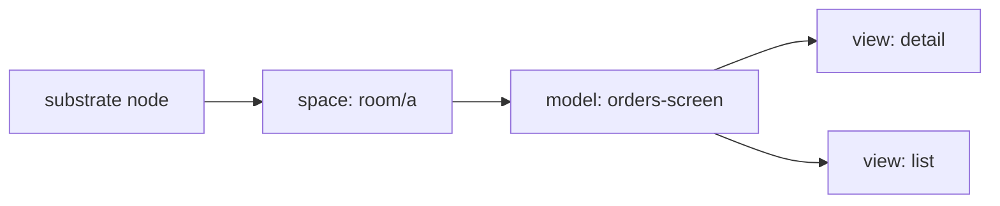
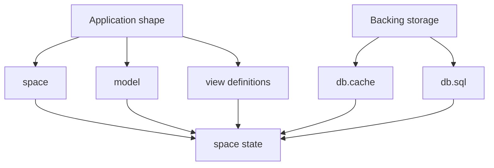
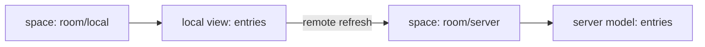
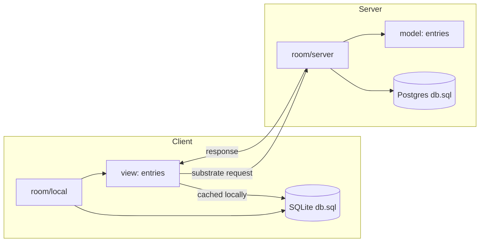
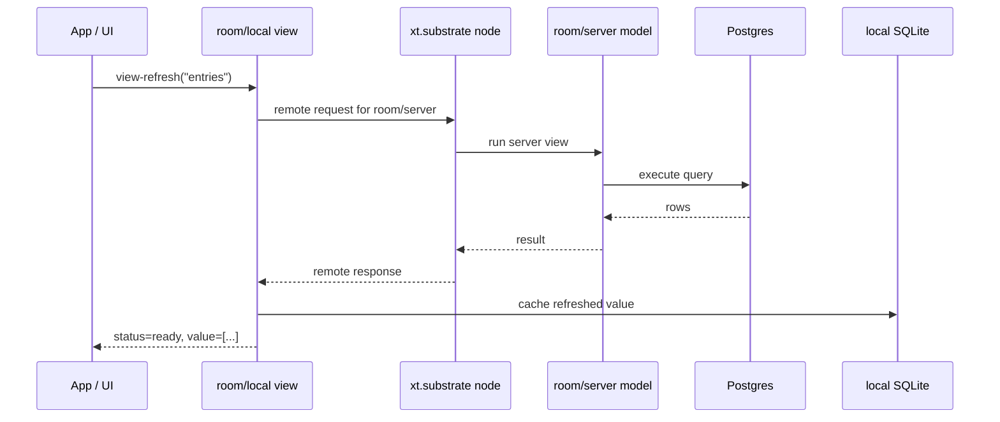
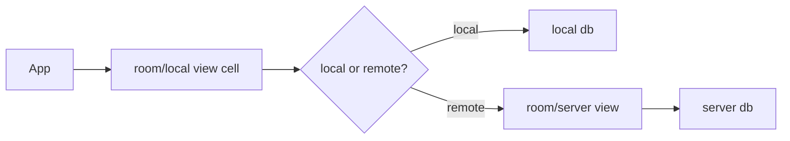

# `xt.db` + `xt.substrate` Walkthrough

This is a GitHub-flavored explainer for how `xt.db` is used inside
`xt.substrate` to build application state for an admin-style SPA screen.

The main target shape is:

- a list view on a table
- a filtered local input for that list
- a detail view on the same table
- a local cache that keeps the SPA coherent while server state changes

The examples mirror these walkthrough tests:

- `test-lang/xt/db/walkthrough/guide_00_model_basic_test.clj`
- `test-lang/xt/db/walkthrough/guide_02_application_flow_test.clj`
- `test-lang/xt/db/walkthrough/guide_09_local_sqlite_remote_postgres_test.clj`
- `test-lang/xt/db/walkthrough/guide_10_remote_sqlite_postgres_pipeline_test.clj`


## The Short Version

- `xt.substrate` gives you the node, spaces, and request/response transport.
- `xt.db` gives you models, views, query planning, cached results, and refresh.
- A **space** is an application context such as `"room/local"` or
  `"room/server"`.
- A **model** is a named bundle of views.
- A **view** is a live query cell with input, status, value, and dependencies.


## 1. Minimal Model: No DB Yet

The smallest useful shape is a node with one space and one model representing
an admin screen with two views on the same table.



At this stage, think of `xt.db` as a **reactive model registry**:

- install the schema + lookup rules on a node
- put a screen model into a space
- refresh the list and detail views
- read cached SPA state from the local view cells

The guide-00 walkthrough does exactly that.

### Minimal install

```clojure
(var node (event-node/node-create {"id" "node-a"}))

(model/install node
               {"schema" ...
                "lookup" ...
                "views"  {}})
```

### Minimal model

```clojure
(model/model-put node
                 "room/a"
                 "orders"
                 {"views"
                  {"detail" {"query" ... "input" [selected-id]}
                   "list"   {"query" ... "input" ["open"]}}})
```

That gives you:

- a space: `"room/a"`
- a model: `"orders-screen"`
- two view cells on the same table: `"detail"` and `"list"`

### What lives in a view cell

Conceptually, a view looks like this:

```clojure
{"query" ...
 "input" []
 "status" "idle"
 "value" nil
 "query_key" nil}
```

After a refresh, the same cell becomes:

```clojure
{"status" "ready"
 "value" [...]
 "query_key" "..."}
```

So even before SQL is involved, the important idea is:

> `xt.db` gives you named live cells inside a space.


## 2. Why Define Models Before DBs?

Because the model is the **application shape**, while the DB is only a
**backing execution engine**.



This is the js.cell-style part of the design:

- first define the cells you want
- then decide where those cells read from

That makes it possible to:

- start with pure local/demo state
- move a view to a remote space later
- add SQL without changing the application-facing model shape


## 3. Minimal Remote Composition

Now split the app into two spaces:

- `"room/server"` = authoritative application state
- `"room/local"` = client-facing state



The server model is defined normally:

```clojure
(model/model-put node
                 "room/server"
                 "entries"
                 (@! fixtures/+model-spec+))
```

The local model is only a proxy view:

```clojure
(model/model-put node
                 "room/local"
                 "entries"
                 {"views"
                  {"entries"
                   {"query"  (@! fixtures/+model-query+)
                    "input"  []
                    "remote" {"space" "room/server"}}}})
```

This is the key difference:

- **server `model-put`** defines the actual source model
- **local `model-put`** defines a client cell that refreshes from a remote space

No SQL detail is required to understand this step. It is still just:

- local view cell
- remote space
- refresh through substrate


## 4. Adding Databases

Once the application shape is stable, attach DBs to spaces.

In the walkthrough:

- `"room/server"` uses **Postgres** `db.sql`
- `"room/local"` uses **SQLite** `db.sql`



The important point is that **spaces own DB attachments**:

```clojure
(xt/x:set-key (model/ensure-space-state node "room/server")
              "db"
              server-db)

(xt/x:set-key (model/ensure-space-state node "room/local")
              "db"
              local-db)
```

So the view definition does not need to know whether it is backed by:

- in-memory cache
- SQLite
- Postgres

It only needs to know:

- what query to run
- what input to use
- whether it should refresh locally or remotely


## 5. End-to-End Refresh Flow

This is the practical application flow used by the walkthrough.



What the application sees is much simpler:

1. create a node
2. install `xt.db`
3. put models into spaces
4. attach DBs to spaces if needed
5. call `view-refresh`
6. read `view-get` / `view-val`


## 6. Why SQLite On The Local Side?

Using SQLite for `"room/local"` makes the client cache explicit.

That gives you a nice separation:

- **Postgres** = source of truth
- **SQLite** = local materialized cache/projection

This is useful because the local space can:

- keep query results in a real SQL store
- support local reads after refresh
- behave like an application cache instead of a transient in-memory blob


## 7. Minimal Mental Model

If you only remember one diagram, use this one:



And if you only remember one sentence, use this:

> `xt.substrate` moves requests between spaces, and `xt.db` turns those spaces
> into live query cells.


## 8. Mapping To The Walkthrough Files

### `guide_00_model_basic_test.clj`

Use this when you want to understand:

- how a same-table admin screen is modeled locally
- detail + filtered list views on one table
- local cache-backed screen refresh
- local selection/filter changes

This is the best place to learn the **local admin-screen mental model**.

### `guide_02_application_flow_test.clj`

Use this when you want to understand:

- local vs server spaces for the same admin screen
- remote-backed list/detail views
- Postgres on the server
- SQLite on the client
- local cache tracking server-backed refreshes

This is the best place to learn the **remote admin-screen topology**.

### `guide_09_local_sqlite_remote_postgres_test.clj`

Use this when you want to test the exact implementation split:

- local admin screen state in SQLite
- remote server execution in Postgres
- same-table list/detail views
- a remote update followed by a local selection change

This is the best place to learn the **dedicated SQLite-local / Postgres-remote implementation path**.

### `guide_10_remote_sqlite_postgres_pipeline_test.clj`

Use this when you want to test the direct remote view pipeline:

- local screen state attached to SQLite
- server space attached directly to Postgres
- `model/view-refresh` or `model/model-refresh` on the local space
- remote query dispatch through `run-view-remote` / `run-remote-query`

This is the best place to learn the **true SQLite-local / Postgres-remote query pipeline**.

### `guide_04_view_lifecycle_test.clj` through `guide_08_local_db_options_test.clj`

Use these when you want to understand the supporting behavior behind that same
screen shape:

- lifecycle of the selected detail panel and filtered list
- hook-style screen state
- dependency links between detail and list
- stale/invalidation behavior when the shared table changes
- remote projection into a local list/detail screen
- `db.cache` vs SQLite for the local admin screen


## 9. Practical Reading Order

1. Start with `guide_00_model_basic_test.clj`
2. Learn the same-table list/detail screen shape first
3. Then read `guide_02_application_flow_test.clj`
4. Add remote server execution + local cache tracking
5. Then read `guide_09_local_sqlite_remote_postgres_test.clj` for the explicit local-sqlite / remote-postgres setup
6. Then read `guide_10_remote_sqlite_postgres_pipeline_test.clj` for the direct remote query pipeline between SQLite-local and Postgres-backed spaces
7. Then use `guide_04` through `guide_08` for the supporting screen mechanics
8. Finally add DB attachments:
   - server -> Postgres
   - local -> SQLite

That order matches how application developers usually think:

- shape first
- topology second
- storage third


## 10. Summary

- `xt.db` is best understood as a **reactive cell layer**
- `xt.substrate` is the **space/transport/runtime layer**
- spaces hold application context
- models group named views
- views are live query cells
- DBs are attached to spaces, not baked into the model definition
- remote-backed local views let you keep a clean application shape while
  separating:
  - local cache/projection
  - remote authority/source of truth
